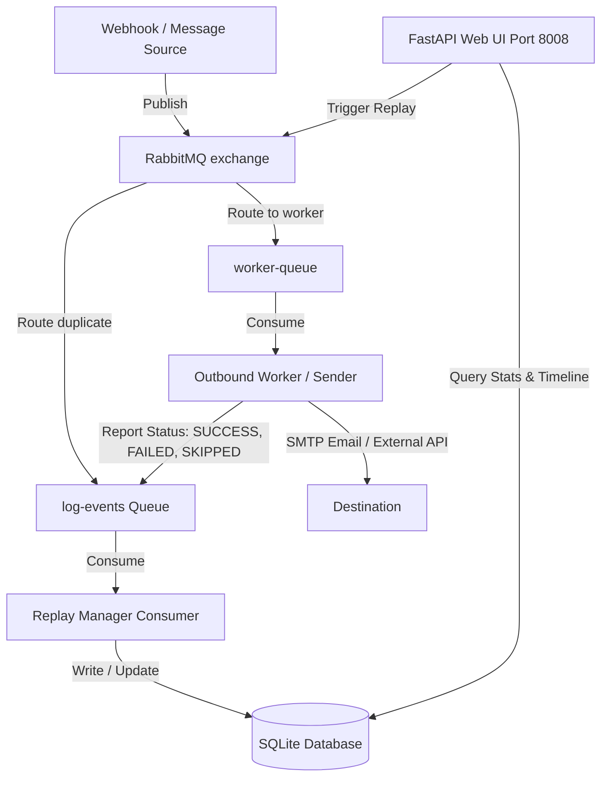

# RabbitMQ Replay Manager & Delivery Tracker

A lightweight, self-hosted RabbitMQ queue management and delivery status log panel with a modern Web UI.

Replay Manager is a resource-efficient, plug-and-play tool designed to track outbound message delivery SLA, log event histories, and trigger manual re-delivery (Replay) of failed events in one click. It is an excellent alternative to heavy distributed tracing systems (like ELK/Jaeger) or complex data flows (like Apache NiFi) for microservice environments.

---

## Key Features

- ⏳ **Real-Time SLA Status Tracking**: Track message lifecycle statuses: `PENDING` (Received), `DELIVERED` (Success), `FAILED` (Error), and `SKIPPED` (Soft-drops/business exclusions).
- 🔄 **One-Click Message Replay**: Re-publish failed or stale events back to their original queue with a single button click in the UI.
- ⚡ **Canonical JSON Payload Hashing**: Leverages sorting-safe SHA256 canonical hashing to track messages across microservices without modifying payload structures.
- 🌍 **Multilingual (EN / UA)**: Smooth on-the-fly UI switching between English and Ukrainian with dark/light theme state persistence.
- 📈 **Stats Dashboard Grid**: Immediate overview of total log count and per-queue message statistics. Click on any queue card to instantly list the latest 30 events.
- 🪶 **Extremely Lightweight**: Built on FastAPI and SQLite (WAL mode). Runs inside Docker consuming **less than 50MB RAM**.
- 🧹 **Auto-pruning Worker**: Built-in background daemon that cleans up database events older than 30 days.

---

## Architecture & Data Flow

Replay Manager works on a **feedback-loop model**:



1. **Exchange Routing**: The input exchange is configured to duplicate messages. One copy goes to the worker queue, while the other copy is sent to the `log-events` queue.
2. **Replay Manager Consumer**: Reads new events from `log-events`, calculates their canonical payload hash, and registers them in the SQLite DB in a `PENDING` state.
3. **Outbound Worker**: Processes the task, calculates the same canonical hash, and publishes a delivery report containing `status` and `error_message` back to the `log-events` queue.
4. **Replay Manager Update**: The consumer reads the report, matches the SHA256 hash, and updates the record status to `DELIVERED`, `FAILED`, or `SKIPPED`.

---

## Quick Start (Docker Compose)

Create a `docker-compose.yml` file:

```yaml
version: '3.8'

services:
  replay_manager:
    image: python:3.11-slim
    container_name: replay_manager
    restart: unless-stopped
    ports:
      - "8008:8005"
    environment:
      - RABBITMQ_HOST=your-rabbitmq-host
      - RABBITMQ_PORT=5672
      - RABBITMQ_USER=guest
      - RABBITMQ_PASS=guest
      - LOG_EVENTS_QUEUE=log-events
      - DB_PATH=/app/data/replay.db
      - LOG_LEVEL=INFO
    volumes:
      - ./data:/app/data
    command: >
      sh -c "pip install fastapi uvicorn pika httpx && python main.py"
```

Run the container:
```bash
docker-compose up -d
```
Access the Control Panel Web UI at `http://localhost:8008`.

---

## Configuring RabbitMQ Message Duplication

To log and track events, Replay Manager needs to receive a copy of every message that goes to your worker queues. This is done purely through **RabbitMQ Bindings** and does not require modifying your main application publisher code.

Depending on your exchange type, configure bindings as follows:

### Option A: Using a Topic Exchange (Recommended)
If your publisher sends messages to a `topic` exchange:
1. Bind your worker queues to the exchange with their specific routing keys (e.g., `sms-sender`, `email-sender`).
2. Bind the `log-events` queue to the **same exchange** using the wildcard routing key `#` (matches everything) or a pattern like `notification-#`.
3. RabbitMQ will automatically clone and route a copy of every matching message to `log-events`.

### Option B: Using a Direct Exchange
If your publisher sends messages to a `direct` exchange:
1. Bind your worker queues to the exchange with their specific routing keys (e.g., routing key `sms-sender` binds to queue `sms-sender`).
2. Bind the `log-events` queue to the **same exchange multiple times** using the exact same routing keys (e.g., bind `log-events` with key `sms-sender`, bind `log-events` with key `email-sender`).
3. Since RabbitMQ routes messages to *all* queues bound with a matching key, both your worker queue and `log-events` will receive a copy of the message.

---

## Integrating Your Outbound Workers (Senders)

To let Replay Manager track statuses, your workers should report their results to the `log-events` queue.

1. **Calculate Canonical Hash**: Make sure the JSON payload keys are sorted and stripped of extra whitespaces to generate a consistent SHA256 signature.
2. **Send Delivery Report**: Publish a message containing the hash, status, and any optional error details.

Refer to [`examples/python_sender_sdk.py`](examples/python_sender_sdk.py) for a complete copy-pasteable Python implementation.

### Status Report JSON Schema:
```json
{
  "is_report": true,
  "event_hash": "a4d3f568b2...",
  "status": "SUCCESS",
  "error_message": "Optional SMTP connection error trace or skip reason",
  "routing_key": "my-worker-queue"
}
```

---

## License

This project is licensed under the MIT License. See the [LICENSE](LICENSE) file for details.
